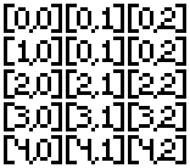

# Welcome to the fun world of 2D Arrays

For furthur documentation from Java: [Class Arrays](https://docs.oracle.com/javase/7/docs/api/java/util/Arrays.html).

## Visualizing a 2D array

Let's start by visualizing the data in a 2d Array

As you can see, it is pretty straightforward. Just make that you notice that the array starts at `[0,0]`.

Now we can continue on to defining and intitalizing 2d arrays.
